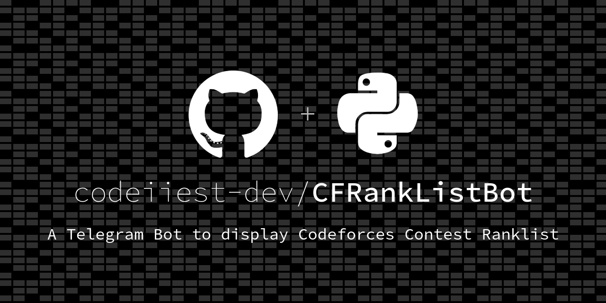
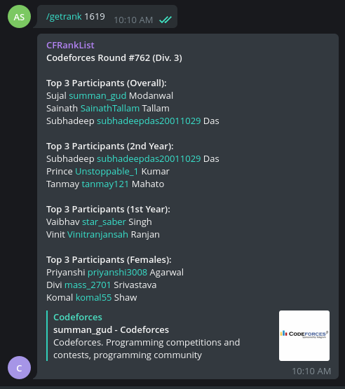

[![Contributors][contributors-shield]][contributors-url]
[![Stargazers][stars-shield]][stars-url]
[![Issues][issues-shield]][issues-url]
[![Forks][forks-shield]][forks-url]

<div align="center">
  <a href="https://github.com/codeiiest-dev/CFRankListBot">
    
  </a>

  <h3 align="center">CFRankListBot</h3>

  <p align="center">
    <a href="https://github.com/codeiiest-dev/CFRankListBot/issues">Report Bug</a>
    ·
    <a href="https://github.com/codeiiest-dev/CFRankListBot/issues">Request Feature</a>
  </p>
</div>

## Participants' Details

All the details of a participant is in the `utils/__init__.py` file.

## Commands

### `/getrank <contest-id>`

Gets the ranklist for the particular contest.

## Demo



## Development

1. Search for @botfather in Telegram.
2. Start your conversation by pressing the Start button.
3. Create the bot by running /newbot command
4. Enter the Display Name (use any name that is available) and User Name for the bot.
5. BotFather will send you a message with the token.
6. Make a `.env` file `cp .env_sample .env`.
7. Fill the token in the `.env`.
8. Run the following commands:

```bash
pip install -r requirements.txt # to install dependencies
python3 bot.py
```

## Deplopy

Use 1-click heroku deploy

[](https://heroku.com/deploy?template=https://github.com/codeiiest-dev/CFRankListBot)

[contributors-shield]: https://img.shields.io/github/contributors/codeiiest-dev/CFRankListBot?style=for-the-badge
[contributors-url]: https://github.com/codeiiest-dev/CFRankListBot/graphs/contributors
[forks-shield]: https://img.shields.io/github/forks/codeiiest-dev/CFRankListBot?style=for-the-badge
[forks-url]: https://github.com/codeiiest-dev/CFRankListBot/network/members
[stars-shield]: https://img.shields.io/github/stars/codeiiest-dev/CFRankListBot?style=for-the-badge
[stars-url]: https://github.com/codeiiest-dev/CFRankListBot/stargazers
[issues-shield]: https://img.shields.io/github/issues/codeiiest-dev/CFRankListBot?style=for-the-badge
[issues-url]: https://github.com/codeiiest-dev/CFRankListBot/issues
